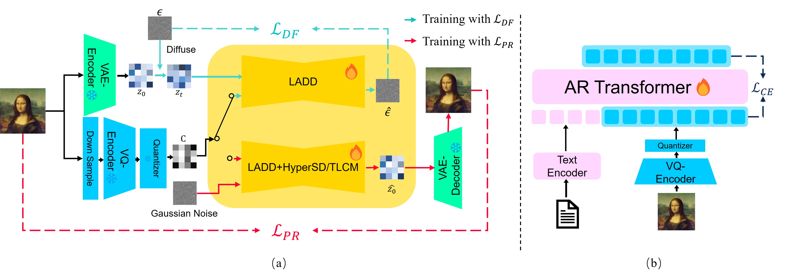

# LaCTok:Latent Consistency Tokenizer for High-resolution Image Reconstruction and Generation by 256 Tokens

This repository contains code for the paper [LaCTok:Latent Consistency Tokenizer for High-resolution Image Reconstruction and Generation by 256 Tokens](https://arxiv.org/abs/2503.08377).
### Abstract
*Image tokenization has significantly advanced visual generation and multimodal modeling, particularly when paired with autoregressive models. However, current methods
face challenges in balancing efficiency and fidelity:
high-resolution image reconstruction either requires an excessive
number of tokens or compromises critical details
through token reduction. To resolve this, we propose Latent
Consistency Tokenizer (Layton) that bridges discrete  visual tokens with the compact latent space of pre-trained
Latent Diffusion Models (LDMs), enabling efficient representation
of 1024×1024 images using only 256 tokens—a
16× compression over VQGAN. Layton integrates a transformer
encoder, a quantized codebook, and a latent consistency
decoder (LCD). Direct application of LDM as
the decoder results in color and brightness discrepancies;
thus, we convert it to latent consistency decoder, reducing
multi-step sampling to 1-2 steps for direct pixel-level
supervision. Experiments demonstrate Layton’s superiorarity in high-fidelity reconstruction, with 10.8 reconstruction
Frechet Inception Distance on MSCOCO-2017 5K benchmark
for 1024×1024 image reconstruction. We also extend
Layton to a text-to-image generation model, Layton-
Gen, working in autoregression. It achieves 0.73 score
on GenEval benchmark, surpassing current state-of-the-art
methods.*

### Summary figure

<p align="center">
    
</p>

*1024-pixel image generation results of LaCTokGen-T* in an autoregressive way with 256 tokens, demonstrating
the capability of LaCTokGen-T* in high-quality image synthesis.*

<p align="center">
    
</p>

*Overview of our tokenizer and text-to-image model.*

## Code

### Setup

```bash
pip install -r requirements.txt
```


### Image generation
*Please download pretrained tokenizer (LaCTok-T) and auto-regressive model (LaCTokGen-T) from from OPPOer/LaCTok and text encoder from google/flan-t5-xl*

```bash
python demo.py \
--cfg-scale 2 \
--cls-token-num 120 \
--top-k 1000 \
--ckpt "<Tokenizer path>" \
--t5-path "<text encoder path>"
--temperature 0.1 \
--gpt-ckpt "<Transformer path>" --gpt-model GPT-XL --image-size 256 \
--seed 42\
```

